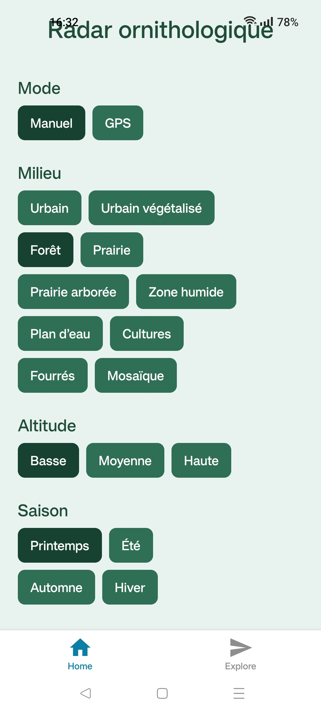
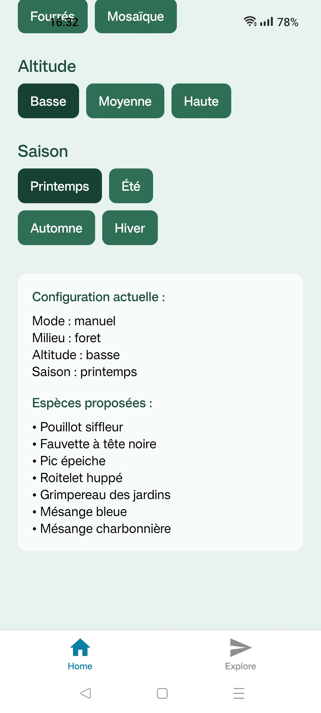
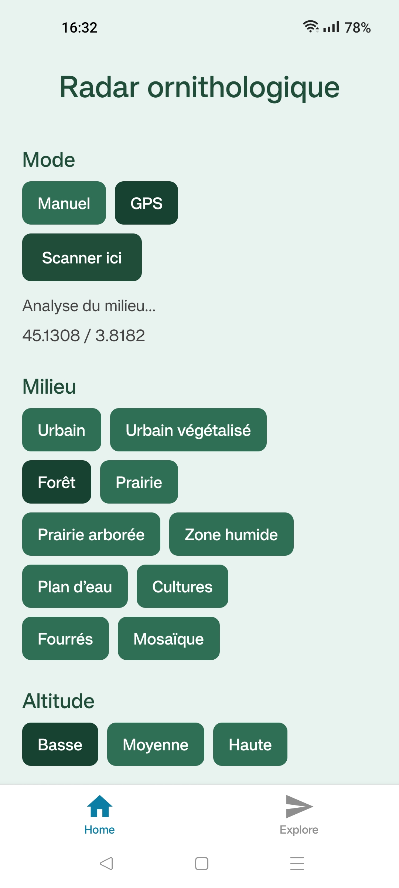
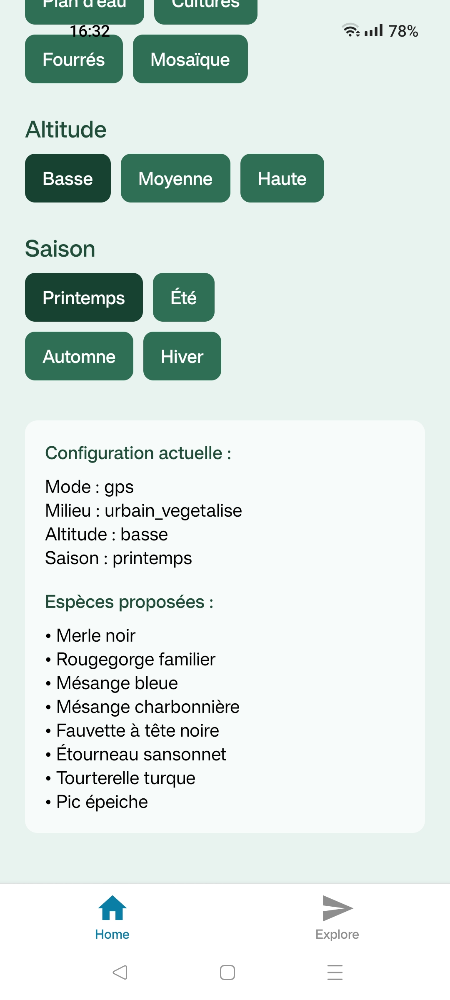

#  Radar ornithologique – application mobile

##  Description

Application mobile permettant de suggérer les espèces d’oiseaux probables en fonction de la position GPS, de l’occupation des sols, de l’altitude et de la saison.

Projet personnel à l’intersection du naturalisme et du développement mobile, avec une approche basée sur l’analyse de données géospatiales.

##  Aperçu de l'application

 

##  Fonctionnement

1. Récupération de la position GPS
2. Interrogation d’un proxy Node.js local
3. Lecture d’un raster satellite WorldCover (ESA)
4. Analyse spatiale multi-pixels (buffer 9x9)
5. Interprétation écologique du milieu
6. Suggestion d’espèces probables

##  Technologies utilisées

* React Native (Expo)
* Node.js / Express
* GeoTIFF (ESA WorldCover)
* API REST (JSON)

##  Architecture

Mobile → API proxy → Raster satellite → Distribution des classes → Habitat → Espèces

##  Fonctionnalités actuelles

* Mode manuel / mode GPS
* Détection du milieu via données satellite
* Analyse spatiale (buffer 9x9)
* Interprétation écologique :

  * urbain végétalisé
  * prairie arborée
  * forêt feuillus
  * etc.
* Système de suggestion d’espèces basé sur habitat, altitude et saison

##  État du projet

* Proxy local (non déployé en production)
* Base espèces (`speciesData.js`) en cours de construction
* Modèle écologique simplifié (version 1)
* Application fonctionnelle en environnement de développement

##  Objectifs

* Intégrer l’altitude automatiquement
* Affiner la saisonnalité
* Améliorer l’interprétation des milieux (pondérations, mix habitats)
* Intégrer des données d’observation réelles
* Déployer le proxy (API distante)

##  Méthodologie

Ce projet a été développé en autonomie avec l’IA pour accélérer l’apprentissage et la résolution de problèmes techniques.

L’accent a été mis sur la compréhension des concepts (API, géolocalisation, données raster), leur application à un cas concret en écologie, la construction progressive d’un modèle de prédiction simple.

## Auteur

Projet personnel – apprentissage du développement web/mobile avec orientation naturaliste.
